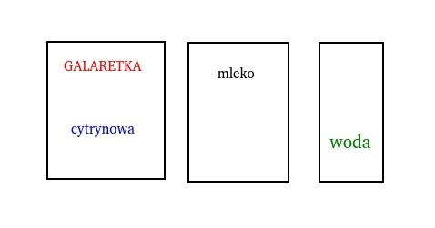
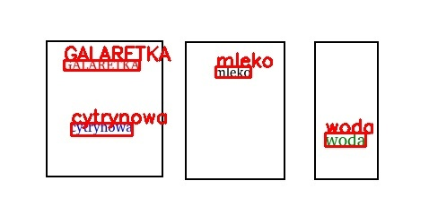

# Serwis detekcji tekstu

## Cel 

Potrzebujemy bohaterów, którzy mogą dostarczyć kompletne rozwiązanie realnych problemów, przed którymi stajemy.

W dziedzinach, wokół których koncentrujemy nasze działania, bardzo wiele można podpatrzeć u innych, którzy chętnie dzielą się kodem (internet). Chcemy sprawdzić, czy nasz przyszły kompan jest w stanie połączyć wszystkie elementy układanki i dostarczyć prosty serwis dokonujący detekcji tekstu.

W poniższym zadaniu nie ma trudnych algorytmów, a nacisk jest położony na praktyczne wykorzystanie wiedzy, którą łatwo odnaleźć w internecie.
Hasła kluczowe:
- docker
- rest api
- detekcja tekstu


##  Opis zadania

Przygotuj serwis, który dokona detekcji tekstu na zadanym obrazie.
Rozwiązanie powinno mieć postać obrazu dockera (załącz Dockerfile i instrukcję budowania i uruchomienia obrazu).
Do komunikacji z serwisem użyj REST API, za pomocą którego klient serwisu dostarczy obraz metodą POST na url = '/ocr'.

W odpowiedzi, serwis powinien zwrócić jsona zawierającego listę rozpoznanych obiektów, zawierających współrzędne bounding boxa w pikselach (left, top, right, bottom) oraz rozpoznany tekst (pole text).

Poza wymienionymi powyżej, nie ograniczamy użytych technologii (chociaż podpowiadamy poniżej).


## Wynik

Elementy niezbędne do zaliczenia zadania:
- kod źródłowy serwisu
- skrypt (ewentualnie opis) budujący i uruchamiający obraz dockera z działającym serwisem: niech usługa, po uruchomieniu będzie dostępna lokalnie na porcie http 8000.


W zależności od wybranych technologii i narzędzi (zwłaszcza detektora tekstu), możesz uzyskać nieco inne wyniki.
Dlatego w tym zadaniu nie wymagamy precyzyjnego wyniku dla zadanego obrazu. Ważne, aby usługa implementowała zadane API.

Za pomocą dostarczonego przez Ciebie skryptu (ewentualnie instrukcji) zbudujemy i uruchomimy obraz oraz za pomocą przykładowego skryptu, spróbujemy się skontaktować z usługą, oceniając uzyskany wynik. 

Ocenimy również jakość kodu.

Rekomendujemy użycie języka python ale dopuszczamy również rozwiązania zaimplementowane w javie.


## Przykłady

Wynik Twojej pracy sprawdzimy, między innymi na tym obrazku:




Jeśli za pomocą dostarczonych przez Ciebie skryptów zbudujemy i uruchomimy obraz dockera stawiający serwis, to sprawdzimy:
1. przykładowe żądanie za pomocą narzędzia 'curl':
```bash
curl -X POST http://localhost:8000/ocr -F "file=@serwis_detekcji_tekstu_image.jpg"
```

Oczekiwana odpowiedź (formatowanie nie jest istotne, a dokładne wyniki mogą się różnić w zależności od użytej technologii detekcji tekstu):
```json
[
    {
        "left": 71,
        "top": 67,
        "right": 155,
        "bottom": 78,
        "text": "GALARETKA"
    },
    {
        "left": 79,
        "top": 137,
        "right": 147,
        "bottom": 151,
        "text": "cytrynowa"
    },
    {
        "left": 240,
        "top": 74,
        "right": 279,
        "bottom": 86,
        "text": "mleko"
    },
    {
        "left": 362,
        "top": 148,
        "right": 407,
        "bottom": 163,
        "text": "woda"
    }
]
```
2. wizualizację wyników za pomocą poniższego skryptu python:
```python
import requests
import json
import cv2 

r = requests.post("http://localhost:8000/ocr", files={'file': open('serwis_detekcji_tekstu_image.jpg','rb')})

img = cv2.imread('serwis_detekcji_tekstu_image.jpg')
for b in r.json():
    img = cv2.rectangle(img, (b['left'], b['top']), (b['right'], b['bottom']), (0, 0, 255), 2)
    ing = cv2.putText(img, b['text'], (b['left'], b['top']), cv2.FONT_HERSHEY_SIMPLEX, 0.7, (0, 0, 255), 2)

cv2.imshow('img', img)
cv2.waitKey(0)

```
Wynik powinien wyglądać mniej więcej tak:



## Przydatne linki

1. Mimo, że nie wymagamy użycia konkretnej technologii detekcji tekstu, to podpowiadamy, że można użyć np. pakietu tesseract (https://pypi.org/project/pytesseract/ jeśli użyjesz języka python).
2. Możesz użyć dowolnego frameworka do implementacji REST API, a jednym z nich jest FastAPI: https://fastapi.tiangolo.com/
3. Inne, popularne biblioteki używane przy rozwiązywaniu podobnych wyzwań, to opencv i numpy.
